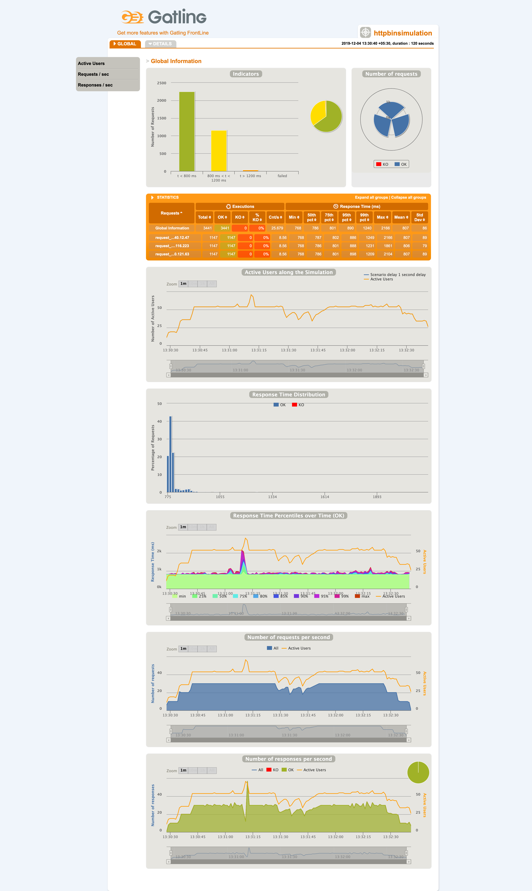

### Gatling cluster

## VM provisioning

If you want to provision aws VMs for gatling cluster then please follow this [AWS VMs](aws/README.md)   
If you want to provision azure VMs for gatling cluster then please follow this [Azure VMs](azure/README.md)   

## Simulate Gatlings
Fully automated simulation can be done by running simulateGatlings.sh. It performs all below tasks. Please refer to below verbose outputs for individual task runs.   
```
$simulateGatlings.sh aws HttpBinSimulation
******************************************************************************************************************
*********************************************** Gatling Simulation Started ***************************************
***More verbose logs***
******************************************************************************************************************
*********************************************** Gatling Simulation Success ***************************************
```

#Global run variables
```
$variablesGatlings.sh aws HttpBinSimulation
******************************************************************************************************************
*********************************************** Variable Setup ***************************************************
Getting hosts from aws
### Wed Dec  4 11:01:08 IST 2019 Running gatling on [34.240.12.47	34.245.116.223	34.250.121.63]
```

#Setup local
```
$setupLocal.sh
******************************************************************************************************************
*********************************************** Local Setup ******************************************************
Downloading gatling 3.3.1.zip
***More verbose logs***
Unzipping gatling 3.3.1.zip
Setup completed
```

#AWS/Azure provision
```
$terraform init
$terraform apply -var "my_public_ip=`curl ifconfig.me`"  -auto-approve
******************************************************************************************************************
*********************************************** Gatling Apply ***************************************************

Initializing the backend...

Initializing provider plugins...

***More verbose logs***

data.aws_ami.linux: Refreshing state...
data.aws_vpc.default: Refreshing state...
aws_key_pair.kp: Refreshing state... [id=gatling_cluster_key]
data.aws_subnet.default: Refreshing state...

***More verbose logs***

Apply complete! Resources: 6 added, 0 changed, 6 destroyed.

Outputs:

network_interface_private_ip = [
  "34.240.12.47",
  "34.245.116.223",
  "34.250.121.63",
]
```

#Setup remote gatlings
```
$setupGatlings.sh aws HttpBinSimulation
******************************************************************************************************************
*********************************************** Gatling Setup ****************************************************
Getting hosts from aws
### Wed Dec  4 11:03:38 IST 2019 Running gatling on [34.240.12.47	34.245.116.223	34.250.121.63]
### Wed Dec  4 11:03:38 IST 2019 Cleaning previous runs from localhost
### Wed Dec  4 11:03:38 IST 2019 Cleanup and setup on hosts
***More verbose logs***
Waiting 10 seconds for downloads to finish
Unzipping gatling on host: 34.240.12.47
Unzipping gatling on host: 34.245.116.223
Unzipping gatling on host: 34.250.121.63
```

#Start remote gatlings
```
$startGatlings.sh aws HttpBinSimulation
******************************************************************************************************************
*********************************************** Gatling Start ****************************************************
Getting hosts from aws
### Wed Dec  4 11:04:23 IST 2019 Running gatling on [34.240.12.47	34.245.116.223	34.250.121.63]
### Wed Dec  4 11:04:23 IST 2019 Starting Gatling cluster run for simulation: HttpBinSimulation
***More verbose logs***
Running simulation on host: 34.240.12.47
***More verbose logs***
Running simulation on host: 34.245.116.223
***More verbose logs***
Running simulation on host: 34.250.121.63
```

#Wait for gatlings
```
$waitGatlings.sh aws HttpBinSimulation
******************************************************************************************************************
*********************************************** Gatling Wait *****************************************************
Getting hosts from aws
### Wed Dec  4 11:04:45 IST 2019 Running gatling on [34.240.12.47	34.245.116.223	34.250.121.63]
### Wed Dec  4 11:04:45 IST 2019 Waiting for gatling(s) to complete
Wed Dec  4 11:04:53 IST 2019 Hosts in progress 34.240.12.47 34.245.116.223 34.250.121.63 
Wed Dec  4 11:05:00 IST 2019 Hosts in progress 34.240.12.47 34.245.116.223 34.250.121.63 
***More verbose logs***
Wed Dec  4 11:05:43 IST 2019 Hosts in progress 34.240.12.47 34.245.116.223 34.250.121.63 
***More verbose logs***
Wed Dec  4 11:06:40 IST 2019 Hosts in progress 34.240.12.47 34.245.116.223 34.250.121.63 
Wed Dec  4 11:06:47 IST 2019 Hosts in progress 34.240.12.47 34.245.116.223 34.250.121.63 
Wed Dec  4 11:06:53 IST 2019 Hosts in progress 34.250.121.63 
All host runs completed
```

#Stop remote java's
```
$stopGatlings.sh aws HttpBinSimulation
******************************************************************************************************************
*********************************************** Gatling Stop *****************************************************
Getting hosts from aws
### Wed Dec  4 13:32:48 IST 2019 Running gatling on [34.240.12.47	34.245.116.223	34.250.121.63]
### Wed Dec  4 13:32:48 IST 2019 Killing Gatling java's
***More verbose logs***
```

#Collect, aggregate and display gatling report
```
$resultGatlings.sh aws HttpBinSimulation
******************************************************************************************************************
*********************************************** Gatling Result ***************************************************
Getting hosts from aws
### Wed Dec  4 11:07:02 IST 2019 Running gatling on [34.240.12.47	34.245.116.223	34.250.121.63]
### Wed Dec  4 11:07:02 IST 2019 Collecting simulation logs
***More verbose logs***                                                                                                                                                                                         100%  256KB 326.8KB/s   00:00    
### Wed Dec  4 11:07:19 IST 2019 Aggregating simulations
***More verbose logs***
Generating reports...

================================================================================
---- Global Information --------------------------------------------------------
> request count                                       3442 (OK=3442   KO=0     )
> min response time                                    768 (OK=768    KO=-     )
> max response time                                   1039 (OK=1039   KO=-     )
> mean response time                                   790 (OK=790    KO=-     )
> std deviation                                         21 (OK=21     KO=-     )
> response time 50th percentile                        786 (OK=786    KO=-     )
> response time 75th percentile                        800 (OK=800    KO=-     )
> response time 95th percentile                        812 (OK=812    KO=-     )
> response time 99th percentile                        884 (OK=884    KO=-     )
> mean requests/sec                                 25.687 (OK=25.687 KO=-     )
---- Response Time Distribution ------------------------------------------------
> t < 800 ms                                          2470 ( 72%)
> 800 ms < t < 1200 ms                                 972 ( 28%)
> t > 1200 ms                                            0 (  0%)
> failed                                                 0 (  0%)
================================================================================

Reports generated in 0s.
Please open the following file: /$LOCAL_DIR/gatling_cluster/gatling-charts-highcharts-bundle-3.3.1/results/reports/index.html
### Wed Dec  4 11:07:30 IST 2019 Displaying report on browser
```

You may have to open report in chrome manually or comment/uncomment script if you are not on mac.   

#AWS/Azure detroy gatling infrastructure
```
$terraform destroy -var "my_public_ip=`curl ifconfig.me`"  -auto-approve
******************************************************************************************************************
*********************************************** Gatling destroy **************************************************
  % Total    % Received % Xferd  Average Speed   Time    Time     Time  Current
                                 Dload  Upload   Total   Spent    Left  Speed
100    14  100    14    0     0     34      0 --:--:-- --:--:-- --:--:--    34
data.aws_vpc.default: Refreshing state...
aws_key_pair.kp: Refreshing state... [id=gatling_cluster_key]
data.aws_ami.linux: Refreshing state...
data.aws_subnet.default: Refreshing state...
***More verbose logs***
aws_key_pair.kp: Destruction complete after 1s
aws_security_group.sg: Destruction complete after 2s

Destroy complete! Resources: 8 destroyed.
```
#Cleanup local
```
******************************************************************************************************************
*********************************************** Cleanup Local ****************************************************
$cleanupLocal.sh
Removing local gatling installs
Removing aws files
Removing azure files
undoing variables.tf changes
Cleanup successful
```
## Gatling report

Combined report looks like the one below.  
